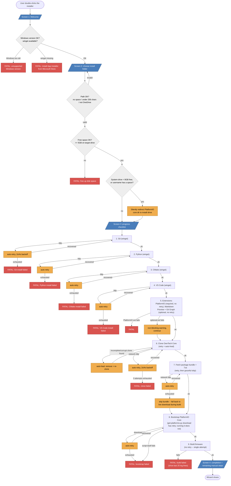

# Plan — Windows Installer for OwnTech Environment Setup

## Session handoff summary (end of session, 2026-07-24)

Read this first. Full chronological detail is in "Testing plan" below; this is the fast-read version for
picking the work back up.

**What exists and works:** `install_owntech.ps1` implements all 6 phases end-to-end and has been run
successfully many times on this machine, both fresh and idempotent re-runs. `reset_environment.ps1`,
`build_platformio_bundle.ps1`, and `run_timed_install_test.ps1` all exist, work, and are documented under
Related files below. Six real bugs were found by actually running things (not by inspection) and are all
fixed — see the numbered list in "First real-machine test pass" and "Timed reset+reinstall tooling" below
if you need the details of any specific one.

**Current measured baseline:** a genuine from-scratch install takes **~13 minutes**, of which **Phase 5
(PlatformIO Core bootstrap + toolchain/framework download + build) is ~10.5 minutes — over 80% of the
total**. With a Windows Defender exclusion for the PlatformIO core dir + project folder, Phase 5 drops to
**~7m40s, total ~10m09s (a 23% reduction)** — this was the single biggest, best-evidenced win found this
session, bigger than the bundle mechanism. See "Defender exclusion result" below for the full table.

**What's NOT yet done:**
- The Defender exclusion is manual/elevated, not wired into the installer. Next step if pursued: an
  opt-in, elevation-gated `-AddDefenderExclusion` switch (see that section for why it should stay opt-in).
- The `-BundleUrl` pre-baked-package feature is fully implemented and tested but **not published anywhere**
  — no GitHub Release exists yet. `build_platformio_bundle.ps1` is ready to generate one whenever a
  maintainer wants to. Note: it measured as a *wash* on this machine (file-count-driven `Expand-Archive`
  overhead ate the network savings) — see "Bundle before/after measurement" before assuming it's a clear
  win elsewhere.
- Windows 10 has never actually been tested (this machine is Windows 11 build 26200, despite earlier
  assumptions). Deliberately-bad-path validation (OneDrive/spaces/length) and an interrupted-network
  scenario are also untested — all three were in the original test matrix and remain open.
- A real, reproducible PlatformIO Core bug was found (core-dir redirect non-deterministically ignored for
  some packages, causing writes to fall back to the system drive) — see "Discovered: non-deterministic
  PlatformIO core-dir fallback to C:". Not fixable from this project; worth an upstream issue if pursued.

**Machine-specific context that matters for continuing this work:** this is not a dedicated disposable
test machine — it's the user's actual daily machine (a personal/shared Windows 11 laptop with a second
user account, "aperot", also present). It runs **without administrator rights** — confirmed not just
"unelevated" but genuinely not a member of the Administrators group, which blocks: CMake's uninstall
(fails with winget exit 1603 every time), viewing/setting Defender exclusions directly, viewing shadow
copy/restore point storage, and anything else requiring elevation. `reset_environment.ps1` and
`run_timed_install_test.ps1` both had `#Requires -RunAsAdministrator` removed for this reason and use a
warn-but-continue pattern instead. **C: has been critically low on free space all session** (fluctuated
between ~0.1GB and ~4GB, currently more comfortable after cleanup) — this is a real, ongoing constraint
for this machine independent of the installer project; see the disk-space investigation exchange earlier
in the conversation if the full history is needed (largest single culprit found and removed: 2.5GB of
debris from a failed PlatformIO operation writing to the wrong drive). **Always check free disk space
(`Get-PSDrive C`, `Get-PSDrive D`) before running a live install/reset cycle on this machine.**

**Live state on disk right now:** `D:\owntech` holds a working, built OwnTech Core checkout from the last
successful run. `D:\.platformio_core` is fully populated. A Defender exclusion is active (added by the
user, elevated) for both. Some harmless leftover test artifacts remain on `D:\` (an unpublished bundle
zip, a few old log files) — safe to ignore or delete, not load-bearing for anything.

**Suggested next step:** either (a) wire the Defender exclusion into the installer as an opt-in switch
now that it's proven to work, or (b) tackle the still-open test matrix items (Windows 10, bad paths,
interrupted network) to broaden coverage before adding more features. Ask the user which they'd rather
see next if picking this up cold.

## Problem

The manual procedure in [`docs/environment_setup.md`](../environment_setup.md) is currently a major
hurdle for new community members. It is not primarily a communication problem (a video can explain
the steps more clearly) — it is a **reliability problem**: too many steps have silent failure modes
(wrong VS Code installer variant, PATH not updated, project path under OneDrive / containing spaces /
too long, first-build dependency downloads failing quietly), and users hit them before ever seeing a
blinking LED. The troubleshooting section at the bottom of the doc is effectively a list of things an
installer could check and fix automatically instead of asking the user to self-diagnose.

The video remains useful as an explainer, but the actual fix is to remove as many manual, error-prone
steps as possible.

## Goals

- Automate Steps 1–6 of `environment_setup.md` on Windows: project folder, VS Code, PlatformIO
  extension, cloning Core, and a first build.
- Fail fast and specific: every phase validates its own success and reports *what* went wrong and
  *how to fix it*, instead of leaving the user to match symptoms against the troubleshooting list.
- Idempotent: safe to re-run on a machine that's already partially set up (skip what's already there).
- Docs stay as the detailed manual reference; the installer becomes the recommended fast path.

## Non-goals (v1)

- macOS / Linux — different tooling and failure modes, separate effort if pursued later.
- Board upload (Steps 7–8) — hardware-dependent, stays manual for now.
- Polished GUI wizard — start as a script; only invest in an Inno Setup/NSIS-wrapped `.exe` if the
  script proves reliable and the plain-script UX (PowerShell execution policy, looking "unofficial")
  turns out to actually matter to users.

## Approach

A PowerShell script driving `winget`, structured as discrete phases with explicit checks between
them — not one long blind script. This mirrors and reuses the work already done in
[`reset_environment.ps1`](reset_environment.ps1), which resets a machine to a clean state for testing.

Rationale for `winget` over a compiled installer: no bundled installer binaries to keep up to date,
correct silent-install flags are handled per-package by `winget` itself, and it's easy to read/audit
as an open-source script.

## Phases

### Phase 0 — Preflight

- Verify Windows 10 (1809+) or Windows 11.
- Verify `winget` is available; if not, stop with instructions to install "App Installer" from the
  Microsoft Store.
- Check free disk space (doc requires 2GB; add buffer, e.g. require 5GB).
- Ask for / validate the target project folder, enforcing the exact pitfalls called out in the docs:
  - not under a OneDrive-synced path
  - no spaces in the path
  - path length safely under 256 characters
  - warn (not block) if it's deeply nested rather than close to the drive root
- Detect already-installed components (git, python, cmake, VS Code) so later phases can skip them.

### Phase 1 — Install prerequisites

- Git (`Git.Git`)
- Python 3 (pin a specific known-good winget id, e.g. `Python.Python.3.12`)
- CMake (`Kitware.CMake`)
- Refresh the current session's `PATH` after install (a fresh install via winget updates the registry,
  but the running script's process won't see it without re-reading env vars from the registry).

### Phase 2 — Install VS Code

- `Microsoft.VisualStudioCode` via winget.
- Confirm the `code` CLI is reachable on PATH afterward (same PATH-refresh caveat as Phase 1).

### Phase 3 — Install PlatformIO IDE extension

- `code --install-extension platformio.platformio-ide`
- Verify via `code --list-extensions` that it actually landed.
- Also installs two general-purpose extensions users need beyond PlatformIO itself:
  `shd101wyy.markdown-preview-enhanced` and `mhutchie.git-graph`. See "Phase 3/4/5 hardening" below.

### Phase 4 — Clone the Core repository

- `git clone https://github.com/owntech-foundation/Core` into the folder validated in Phase 0.
- Confirm the clone succeeded and `main` is checked out.
- Hardened against interrupted clones and transient network drops — see "Phase 3/4/5 hardening" below.

### Phase 5 — Smoke-test build

- Bootstrap PlatformIO Core the same way the VS Code extension itself does — via the official
  `get-platformio.py` installer, which creates a self-contained venv at `<core dir>\penv` — rather than
  a plain `pip install platformio`. This matters: the extension specifically checks for that `penv`
  layout before it'll skip its own install, so a script-side install that doesn't produce it gets
  silently redone by VS Code the first time the user opens the project, defeating the point of running
  this phase at all. Confirmed via testing (see below) that this produces output identical to what the
  extension does.
- Optionally pre-seed the core dir's `packages`/`platforms` folders from a pre-baked bundle
  (`-BundleUrl`/`-BundleSha256`, see `build_platformio_bundle.ps1`) before the build, so a first-ever
  install on a brand-new machine doesn't fetch the full toolchain/framework set from the network. Purely
  an optimization — omitted or failed download/extraction falls back to a normal full download inside
  the build step itself, never blocks the install.
- Then trigger a real build via that bootstrapped CLI, without requiring the user to open VS Code by
  hand first.
- This catches "is this machine actually ready to code" immediately, with a specific error, rather
  than the user discovering a broken setup only after clicking Build manually later — and it means
  opening the cloned project in VS Code afterward (Phase 6) is instant instead of re-triggering the
  extension's own multi-minute bootstrap.
- Network calls in this phase (bundle zip, `get-platformio.py`, the 7za NuGet fetch) retry with backoff
  on transient failures rather than failing on the first blip. See "Phase 3/4/5 hardening" below.

### Phase 6 — Wrap-up

- Print a summary: what was installed vs. already present vs. skipped.
- Print the remaining manual steps (connect the SPIN board via USB, Build, Upload).
- Optionally auto-open the cloned folder in VS Code (`code <path>`) as the final action.

## Error-handling philosophy

Every phase checks its own outcome rather than trusting an installer's exit code. On failure, report:
what failed, the likely cause, and the exact remediation (a link or a command) — effectively turning
the static troubleshooting list into executable, situation-specific checks. No phase should leave the
machine in a silent partial state.

## Testing plan

- Use `reset_environment.ps1` between iterations to return the test machine to a clean slate. (Original
  plan assumed a dedicated disposable Windows 10 test machine; testing so far has actually happened on
  the user's real Windows 11 daily machine, non-admin — see "Session handoff summary" above.)
- Test matrix:
  - Fresh machine, nothing pre-installed.
  - Partially set up machine (e.g. VS Code already present) — confirms idempotency/skip logic.
  - Deliberately bad paths (OneDrive, spaces, excessive length) — confirms Phase 0 actually blocks them.
  - Interrupted network mid-install — confirms failure is clean, not a silent partial state.
  - Running the installer twice in a row — second run should be a clean no-op.
- Once stable on this machine, repeat on a Windows 11 machine and on a Windows 10 machine without
  winget pre-installed, to confirm the Store-fallback messaging actually works.

### Automated testing

`install_owntech.ps1` supports fully unattended runs, which is what makes the above matrix practical to
actually execute instead of just aspirational:

- `-ProjectPath <path>` sets the target folder without an interactive prompt.
- `-NonInteractive` suppresses every `Read-Host` (the project-path prompt and the final "open in VS
  Code?" prompt), so the script never blocks waiting for input.
- `-SkipBuildTest` skips Phase 5 when a fast Phase 0–4 pass is enough (e.g. while iterating on
  prerequisite-install logic without waiting on a full PlatformIO toolchain download each time).

A standard automated pass, capturing full output and the real exit code:

```powershell
powershell -NoProfile -ExecutionPolicy Bypass -File install_owntech.ps1 -ProjectPath D:\owntech -NonInteractive *> run.log
Write-Host "exit: $LASTEXITCODE"
```

Run this at least twice in a row against the same `-ProjectPath` — the second run should skip every
phase and still exit `0`. This two-run check is what actually caught the idempotency and stale-PATH
bugs below; a single successful run does not exercise the skip-logic paths at all.

Syntax alone can be checked without touching the machine, useful as a fast pre-flight before running
the real thing:

```powershell
$errors = $null
[System.Management.Automation.Language.Parser]::ParseFile('install_owntech.ps1', [ref]$null, [ref]$errors)
$errors
```

### First real-machine test pass (2026-07-24)

Ran against this development machine — Windows 11 (build 26200), not the Windows 10 box the plan
originally assumed, so the Windows 10 leg of the test matrix above is still outstanding. C: had only
~2GB free; D: had 684GB. Four consecutive automated runs (per the recipe above) found and fixed four
real bugs that the syntax check alone could not have caught:

1. **Python "installed" detection was fooled by the Windows Store app-execution-alias stub.**
   `Get-Command python` finds `%LOCALAPPDATA%\Microsoft\WindowsApps\python.exe` even when no real
   Python is installed; running it just prints a Store nag and exits. Phase 0 read that as "Python
   already present" and Phase 1 skipped installing it, so Phase 5 later failed with "Python was not
   found." Fixed with `Test-PythonReal`, which actually invokes `python --version` and checks the
   output starts with `Python `, used both for Phase 0 detection and as Phase 1's install-verification
   callback.
2. **`$ErrorActionPreference = 'Stop'` plus native commands crashed the script on entirely benign
   output.** Git's clone progress text and pip's routine deprecation notices go to stderr; under
   `'Stop'`, PowerShell 5.1 treats that as a terminating error (`NativeCommandError`) and kills the
   script even though the underlying command exited 0. This killed two consecutive runs on harmless
   text. Switched to `$ErrorActionPreference = 'Continue'` globally — every native call already checks
   `$LASTEXITCODE` explicitly rather than relying on exceptions to signal failure.
3. **Idempotency bug in Phase 4.** On a second run, `Get-RepoPath` saw the project folder was
   non-empty (it now contained the first run's clone) and decided to clone a *second* copy into a
   nested `Core` subfolder, instead of recognizing the folder already was the clone. Fixed by checking
   for `.git` in the project path first, before falling back to the "folder is occupied by something
   else" case.
4. **Phase 0's component detection ran before the session's PATH was refreshed from the registry**, so
   a tool installed by an earlier run of the script could still be reported as "installed by this
   script" in a later run's summary — the tool was genuinely already there, but Phase 0 checked before
   PATH caught up. Fixed by calling `Update-SessionPath` at the very start of Phase 0, before detection
   runs.

Also added disk-space handling not in the original design: PlatformIO's actual disk usage (toolchain
and framework downloads, hundreds of MB) lands in `~/.platformio` on the *system* drive by default,
independent of where the project folder lives — so Test-DiskSpace passing against a roomy project drive
doesn't guarantee Phase 5 won't fail (or fill C:) if the system drive is tight. `Set-PlatformIOCoreDir`
now redirects PlatformIO's core dir to the project's drive whenever the system drive has under 8GB
free — exactly the situation this test machine was in.

After these fixes, three consecutive runs against the same `D:\owntech` all completed with exit code 0:
a fresh install, a run resuming from a state left over by the pre-fix bugs, and a clean no-op run
confirming full idempotency (every phase skipped, build reused cached toolchains, summary accurately
reported every component as "already present").

Not yet covered by this pass, still open from the test matrix above: a genuinely fresh machine with
nothing pre-installed, a real Windows 10 build, deliberately-bad paths (OneDrive/spaces/length), and an
interrupted-network scenario.

### Second real-machine test pass (2026-07-24, same day)

Prompted by watching VS Code redo a multi-minute PlatformIO Core install after Phase 5 had already
reported "Build succeeded" — the pip-based approach from the first pass built fine but didn't produce
the `penv` layout the extension checks for, so it silently repeated the work. Rewrote Phase 5 to use
PlatformIO's own `get-platformio.py` bootstrap instead (see Phase 5 above), and added optional bundle
pre-seeding (`-BundleUrl`/`-BundleSha256`, `build_platformio_bundle.ps1`) for first-ever installs on a
fresh machine, since the actual west.yml/toolchain download (measured at 2.8GB total on this machine:
1.7GB `packages`, 276MB `platforms`, 525MB `penv`+`python3`) only needs to happen once per machine ever
— PlatformIO's own package manager already reuses its cache on every run after that, bundle or not.

Both new code paths were exercised directly against this machine, not just syntax-checked:

- **Already-bootstrapped skip path** — ran with VS Code's own (independently-triggered) `penv` already
  in place; Phase 5 correctly detected it and skipped straight to `pio run`.
- **Fresh-bootstrap path** — moved `penv` aside to force it, re-ran, and confirmed the script's
  `get-platformio.py` invocation produces output identical to what VS Code's extension itself produces
  ("Creating a virtual environment...", installs the same `platformio` version into the same
  `<core dir>\penv` layout).

Only `packages`/`platforms` are candidates for the pre-baked bundle — `penv`/`python3` are PlatformIO's
own official portable-Python distribution and are better fetched live via `get-platformio.py` each time
than redistributed under this project's own release. At 1.98GB combined (pre-compression), a
`packages`+`platforms` bundle is close to GitHub's 2GB per-release-asset limit;
`build_platformio_bundle.ps1` warns and suggests splitting if a real bundle ends up over that line.
Nothing has been published yet — the bundle feature is wired into the installer and ready to use once a
bundle exists, but no release has been created; that step still needs `gh release create`/`upload` run
by a maintainer with access to wherever it gets hosted.

### Timed reset+reinstall tooling and third real-machine test pass (2026-07-24, same day)

Added per-phase elapsed-time stamps to `install_owntech.ps1`'s own output plus a total in the Phase 6
summary, and `run_timed_install_test.ps1`, which chains `reset_environment.ps1` → a timed
`install_owntech.ps1` run and appends each cycle's result to `install_timing_history.csv` — for
comparing install time across runs (e.g. before/after publishing a bundle). `reset_environment.ps1`
gained `-NonInteractive`, `-ProjectPath`, and `-IncludePython` params, and now also cleans up a
redirected `PLATFORMIO_CORE_DIR` (reading it from the registry rather than assuming the default
`~/.platformio` location).

This machine turned out to not be a member of the local Administrators group at all (not just running
de-elevated) — so the `#Requires -RunAsAdministrator` on `reset_environment.ps1` (and the new wrapper)
was dropped in favor of the same warn-but-continue pattern `install_owntech.ps1` already uses elsewhere,
matching the empirical reality that Git/CMake/VS Code all installed fine at user scope without
elevation here. CMake's uninstall did fail (winget exit 1603) both times it was attempted unelevated —
consistent with that one specifically needing real elevation this account can't grant; a genuinely full
reset of this component needs an actually-elevated session.

Two more real bugs surfaced running the timed cycle end to end for the first time:

5. **`run_timed_install_test.ps1` passed args to `install_owntech.ps1` via array splatting**
   (`@installArgs` built from `@('-ProjectPath', $ProjectPath, ...)`), which binds positionally, not by
   name — so the literal string `"-ProjectPath"` landed in `install_owntech.ps1`'s own `$ProjectPath`
   parameter instead of `-ProjectPath` being recognized as a flag. (`D:\owntech` came through as
   `-ProjectPath.Substring(0,1)` = `"-"`, visible in the log as `drive -:` and a literal folder named
   `-ProjectPath` created in the current directory.) Fixed by switching to hashtable splatting
   (`@{ ProjectPath = $ProjectPath; ... }`), which binds unambiguously by name. The reset step's own
   call was unaffected since it passes named args directly at the call site rather than through a
   splatted variable.
6. **`Install-WingetApp`'s default verify closure called a helper function that `.GetNewClosure()`
   doesn't carry over.** `{ Test-Cmd $VerifyCommand }.GetNewClosure()` captures variables from the
   enclosing scope but not function definitions, so invoking the closure later failed with
   `CommandNotFoundException: Test-Cmd`. This had never been exercised before because Git had always
   already been present in every prior test run, short-circuiting before the post-install verify ever
   ran through this path (Python's equivalent check uses an explicitly-passed `-VerifyScriptBlock`
   instead, a different code path that isn't affected). Fixed by inlining `[bool](Get-Command
   $VerifyCommand -ErrorAction SilentlyContinue)` directly instead of calling out to `Test-Cmd`.

With both fixed, a genuine from-scratch cycle (Git, CMake reinstall attempt, VS Code, PlatformIO
extension, clone, full toolchain/framework download with no bundle and no pre-existing cache) completed
successfully end to end. Per-phase breakdown from that run:

| Phase | Elapsed | Duration |
|---|---|---|
| 0–1: Preflight + Git install | 0:00 → 0:55 | 55s |
| 2: VS Code install | 0:55 → 2:09 | 1m 14s |
| 3: PlatformIO extension | 2:09 → 2:37 | 28s |
| 4: Clone Core | 2:37 → 2:40 | 3s |
| 5: PlatformIO Core bootstrap + full toolchain/framework download + build | 2:40 → 13:09 | 10m 29s |
| **Total** | | **13:09** |

Phase 5 dominates, as expected — this is the part a published `-BundleUrl` bundle is meant to cut down;
worth re-running this same timed cycle once a bundle is published to get a before/after comparison.

### Bundle before/after measurement (2026-07-24, same day) — mixed result

Generated a real bundle from this machine's populated core dir (`build_platformio_bundle.ps1` → 0.36GB
zip, 45,505 files, SHA256 `A566EF91DF4A7E9F734E0058185037AF59C82469E76F176F3AC993326C28FD67`), served it
from a local HTTP server, and ran the timed cycle with `-BundleUrl` pointed at it. Result: **roughly a
wash on this machine, not a clear win**. Isolated `Expand-Archive` timing on the same zip: ~10m40s
(extrapolated from 42,656/45,505 files extracted in 10 minutes before a tool timeout) — comparable to or
slightly worse than the 10m29s Phase 5 took fetching everything over the network in the first place.

The bottleneck is file *count*, not archive size or download time (0.36GB downloaded from localhost in
seconds). `Expand-Archive` has real per-file overhead on Windows — NTFS plus, plausibly, real-time
antivirus scanning each of 45K files as it's written — and that cost scales with file count regardless
of how the archive got onto disk. The bundle mechanism itself is fully verified correct (download,
SHA256 check, extraction, PlatformIO recognizing the pre-seeded packages all work) — this is a
performance finding, not a bug.

Where this still has real value: a user on a slow/unreliable connection (the actual target audience),
where local extraction time stays roughly constant but network fetch time doesn't scale down. Not
proven or disproven here since this machine's connection was fast enough that fetching packages
individually wasn't the bottleneck either.

If bundle extraction speed matters enough to pursue further, options identified but not yet
implemented, roughly in order of effort:
1. Swap `Expand-Archive` for `7z x` (7-Zip CLI) if present — typically much faster than .NET's zip
   extraction for archives with many small files.
2. Trim the bundle: many of the 45K files are headers/docs/debug symbols not needed to build; excluding
   them cuts file count and extraction time together.
3. A temporary Windows Defender exclusion for the extraction path during install — real speedup, but a
   security-posture tradeoff that needs explicit sign-off before wiring in, not something to default on.

### VS Code IntelliSense rebuild setting (separate from the above)

Added `Set-VSCodeAutoRebuildSetting`, called at the end of Phase 4: merges
`"platformio-ide.autoRebuildAutocompleteIndex": false` into the freshly-cloned project's
`.vscode/settings.json`, preserving whatever's already there (the upstream Core repo already ships a
`files.exclude` block in that file). This does **not** affect the Phase 5 timings above — that's a pure
CLI `pio run`, no VS Code or IntelliSense involved. It targets a different slow moment: VS Code's
PlatformIO extension auto-rebuilding the C/C++ autocomplete index when it notices project changes,
which is slow on a Zephyr project with this many include paths and redundant right after a fresh
clone+build. This is a local, machine-specific override layered on top of the upstream repo's own
`.vscode/settings.json` (which this project doesn't control), not a change to the Core repo itself.
Verified in isolation against the real settings.json format — correctly preserves the existing
`files.exclude` block.

Real-world confirmation (2026-07-24): after a full install with this setting in place, opening the
project in actual VS Code and building Blinky from the GUI worked without triggering an IntelliSense
rebuild. This settles the question better than the automated timing attempts below did — no isolated
timing number was obtained, but the setting demonstrably does what it's supposed to.

Correction to the analysis above: `ststm32` is **not** IntelliSense-only. `pio run`'s own build log shows
`platform: ststm32@19.0.0; framework: zephyr` — PlatformIO's Zephyr support for STM32 boards is layered
on top of the `ststm32` platform, so it's part of the normal build too, not something `project init --ide
vscode` uniquely needs. What IS unique to the IDE-init path is unclear from this session's testing; it
may just be a second, redundant resolution of the same platform under different accounting.

### Discovered: non-deterministic PlatformIO core-dir fallback to C: (unresolved, real risk)

While attempting to isolate IntelliSense-rebuild timing via direct `pio project init --ide vscode` /
`pio run` calls (outside `install_owntech.ps1`), the `ststm32` platform and `toolchain-gccarmnoneeabi`
package intermittently installed to the **default** `%USERPROFILE%\.platformio` location on C: instead
of the redirected `D:\.platformio_core`, despite `$env:PLATFORMIO_CORE_DIR` being verified correct
immediately beforehand each time. Same packages, same session, same env var value — sometimes landed on
D:, sometimes on C:. This happened three separate times during manual testing, twice requiring an
emergency process kill to stop it from filling C: to 0 bytes (once down to 0.144GB free before the kill
landed).

Notably, `install_owntech.ps1`'s own Phase 5 (`Invoke-BuildSmokeTest`, plain `pio run` within the same
script process as `Set-PlatformIOCoreDir`) has never exhibited this — only ad-hoc direct `pio`/`pio
project init` invocations in a separate interactive session did. Root cause not identified; possibly
specific to how PlatformIO's package manager resolves core dir for platform vs. tool packages, or
specific to the `ststm32`/`toolchain-gccarmnoneeabi` packages' installation code path specifically. This
is a real reliability risk for anyone running ad-hoc `pio` commands (not just our script) on a machine
with a tight system drive, independent of anything this project controls — worth a GitHub issue against
platformio-core if pursued further, but out of scope to fix here.

### Defender exclusion result (2026-07-24) — the real fix, bigger than the bundle

User added a Windows Defender exclusion for `D:\.platformio_core` and `D:\owntech` (elevated, outside
this session's non-admin reach — see `Add-MpPreference -ExclusionPath`). Re-ran the full timed cycle
immediately after:

| Phase | Before (no exclusion) | After (with exclusion) | Change |
|---|---|---|---|
| 0–1: Preflight + Git | 55s | 57s | ~same |
| 2: VS Code install | 1m14s | 1m07s | ~same |
| 3: PlatformIO extension | 28s | 22s | ~same |
| 4: Clone Core | 3s | 3s | ~same |
| 5: Bootstrap + toolchain download + build | 10m29s | **7m40s** | **−2m49s (−27%)** |
| **Total** | **13m09s** | **10m09s** | **−3m (−23%)** |

Every phase except Phase 5 is unchanged, and Phase 5 — the one dominated by unpacking tens of thousands
of small toolchain/framework files — is where 100% of the ~3-minute gain landed. This confirms real-time
antivirus scanning of each extracted file was a genuine, significant cost, and a bigger lever than the
`-BundleUrl` bundle mechanism turned out to be (which was a wash for the same underlying file-count
reason, working in the opposite direction: nothing to scan away, just nothing to gain either).

Not yet wired into the installer itself — this was a manual, user-elevated one-time change, not something
`install_owntech.ps1` does automatically (adding a Defender exclusion programmatically would need admin
rights the installer doesn't currently require, and doing so silently would be a meaningful
security-posture change deserving explicit user opt-in, matching how it was rolled out here). Worth
considering as an optional `-AddDefenderExclusion` switch (elevation-gated, opt-in) if this pattern holds
up as broadly true rather than specific to this machine's AV configuration.

### Full downloadable local installer + uncompressed core-dir payload — investigation proposal (2026-07-25)

User request: explore packaging the whole installer as a single downloadable local package (vs. today's
plain script), and embedding a pre-populated PlatformIO core dir (and possibly the Core git clone) inside
it in **uncompressed** form, specifically to accelerate Phase 5 by skipping zip extraction entirely.

**Critical risk to test before building anything.** The Defender-exclusion win above (−27% on Phase 5)
was measured on Phase 5 itself — `Invoke-BuildSmokeTest`, PlatformIO's own package manager fetching and
unpacking packages — not on the isolated `Expand-Archive` operation that produced the "bundle is a wash"
verdict in the section above. Those are two different code paths writing files to disk in different ways.
Current evidence supports "AV scanning matters a lot" and "raw `Expand-Archive` is about as slow as
fetching over the network," but does **not** yet isolate compression CPU cost from AV-scan cost from
network cost as three separate variables. Building uncompressed packaging tooling on the untested
assumption "uncompressed = fast" risks reproducing the bundle wash for the same underlying reason: writing
~45,505 individual files to disk is expensive on this machine regardless of whether they arrive via zip
extraction or a raw copy, if the dominant cost is AV scan-on-write rather than DEFLATE decompression.
Treat "uncompressed helps" as an unproven hypothesis, not a design input, until it's cheaply tested —
consistent with this project's established measure-before-building pattern (the `penv` layout
requirement, the bundle wash, and the Defender win were all discovered by running something first).

**Candidate packaging technologies**, evaluated against: does it actually avoid the per-file
extraction/write pass (vs. just relocating where compression happens), does it require admin rights (this
project must stay usable fully unelevated — confirmed constraint on the dev machine), and is it
single-file downloadable given GitHub Releases (2GB/asset) is the only hosting mechanism this project has
ever used (confirmed by a repo-wide search — no CI/CD, no alternate cloud hosting exists anywhere here):

- **7-Zip SFX / self-extracting archive, store mode (`-mx0`)** — doesn't avoid the per-file write pass,
  only removes decompression CPU cost; architecturally the same as `Expand-Archive` for the cost that
  actually matters. Skip as a final vehicle. Do reuse it (or `robocopy`) as the cheap instrument in the
  experiment below, since it isolates the compression-CPU variable specifically.
- **Inno Setup / NSIS with compression disabled** — same limitation: both unpack file-by-file at install
  time regardless of the compression setting. This also really answers the separate "distribution
  wrapper" question already sitting in Open decisions below, not the Phase 5 speed question — keep the
  two questions separate and don't let this reopen the wrapper decision prematurely.
- **Mountable VHD/VHDX, downloaded raw and mounted rather than extracted** — the only candidate that's
  architecturally different from "extract N files": if `PLATFORMIO_CORE_DIR` is pointed directly at a
  folder inside the mounted volume, PlatformIO could read files in place with no bulk file-write pass at
  all. Real open risk: whether `Mount-DiskImage`/assigning a drive letter works without admin rights is
  untested on this (confirmed non-admin) machine — a hard precondition. Worth a narrow, near-zero-cost
  feasibility spike (just try mounting a VHD unelevated) before building any VHD-creation tooling; if
  mount requires elevation, this whole candidate is dead on arrival given the confirmed constraint.
- **robocopy from a mounted network share** — not applicable; there's no network share for an arbitrary
  downloader, only a downloaded artifact.
- **DISM/WIM mount** — skip; historically admin-heavy with no compensating advantage over VHD.

**Hosting/size — an open decision, not a recommendation.** Uncompressed `packages`+`platforms` alone is
~1.98GB, already at/over GitHub's 2GB-per-asset limit before any container-format overhead — worse than
the existing 0.36GB compressed bundle, which already has an unimplemented "split across assets" TODO
(`build_platformio_bundle.ps1` lines ~78-83; `Invoke-BundleSeed` only accepts one `-BundleUrl`/
`-BundleSha256` pair today). Three options, laid out here without choosing one:
1. Split across 2+ GitHub release assets — benefits both the existing `-BundleUrl` feature and any new
   embedded payload; arguably the highest-leverage shared fix regardless of which vehicle wins below.
2. Alternate hosting — none exists today (no CI/CD, no cloud storage config anywhere in this repo); would
   be genuinely new infrastructure, not a reuse of anything already built.
3. Trim the payload (exclude docs/headers/debug symbols not needed to build) — already floated as an
   option in the "if bundle extraction speed matters" list above; could plausibly get uncompressed
   `packages`+`platforms` under 2GB and sidestep the split question entirely.

**Recommended action sequence**, mirroring this project's established measure-before-building pattern —
do not build a packaging vehicle or wrapper until this returns a real, separable signal:
1. Reuse artifacts already on disk from the earlier bundle experiment (the unzipped folder contents,
   `platformio_bundle.zip` + its recorded SHA256) rather than regenerating from scratch.
2. Run isolated timing comparisons to fresh destinations, outside `install_owntech.ps1` entirely: `Copy-
   Item -Recurse` (no Defender exclusion), `robocopy /E` (no exclusion), `Expand-Archive` of the existing
   zip (no exclusion, re-measured fresh rather than reusing the older ~10m40s figure since machine state
   may have changed), then repeat the fastest raw-copy variant *with* the Defender exclusion active.
3. Interpret: if raw-copy-without-exclusion ≈ `Expand-Archive`-without-exclusion, AV-scan/file-count is
   the dominant, vehicle-independent cost → the uncompressed-embedding hypothesis is falsified; redirect
   effort to the already-flagged `-AddDefenderExclusion` opt-in switch instead (see Immediate next step
   below). If raw-copy is meaningfully faster, decompression CPU is a real separable cost → proceed to
   prototyping. Raw-copy-with-exclusion vs. without directly closes the evidence gap above for the
   raw-copy case specifically, not just the Phase-5 PlatformIO-package-manager case.
4. Only if step 3 shows real separable savings, prototype cheaply — but first split the two variables
   "store" (`Compress-Archive`'s Deflate vs. no-compression zip entries) and "extraction tool" (`Expand-
   Archive`/.NET `ZipFile` vs. 7-Zip's CLI) apart, since the step-2 result only proved raw copy beats
   `Expand-Archive`, not *why*: either DEFLATE decompression CPU is the real cost, or `Expand-Archive`'s
   own implementation is slow regardless of compression (documented elsewhere as a known weak point for
   archives with many small entries) — these two explanations point at different fixes, so test them
   independently before combining:
   - Extract the **existing** (Deflate-compressed) zip with 7-Zip's CLI (`7z.exe x`) instead of
     `Expand-Archive` → isolates "does a faster tool alone fix it," compression unchanged.
   - Build a **new store-mode** zip (7-Zip `-mx0`) and extract it with `Expand-Archive` → isolates "does
     removing compression alone fix it," tool unchanged.
   - Only if both individually help would combining them (store-mode zip + 7-Zip extraction, or an SFX
     built the same way) be worth adopting as the production fix in `Invoke-BundleSeed`. If neither helps
     noticeably beyond `Expand-Archive`'s baseline, the earlier raw-copy result stands as the real fix
     and the packaging question becomes "how do we ship a raw folder tree, not a zip, at all" — pointing
     back at the VHD/VHDX path.
   - Only after this split test, if the VHD path is still the live candidate, start with the single
     unelevated `Mount-DiskImage` feasibility check on this machine before writing any VHD-builder tooling.
5. Keep the "full downloadable installer" distribution-wrapper question (Inno Setup/NSIS/signed `.exe`)
   explicitly separate from the payload-embedding question; resolve only after the script itself is
   judged reliable, per the existing Non-goals and Open decisions below.
6. Bring the hosting/size options above to the user as an explicit decision before finalizing any
   packaging work, since it affects every vehicle candidate regardless of which wins step 4.

Critical files for a future session picking this up: `install_owntech.ps1` (`Invoke-BundleSeed`,
`Set-PlatformIOCoreDir`, `Get-PlatformIOCoreDir`, `Invoke-BuildSmokeTest`), `build_platformio_bundle.ps1`
(the 2GB-split TODO and compression-level choice live here), and `run_timed_install_test.ps1` +
`install_timing_history.csv` (extend the existing timed-comparison harness for the step-2 experiment
rather than reinventing it).

#### Steps 1–2 results (2026-07-25/26) — raw copy is genuinely faster, not a wash

**Step 1 (reuse existing artifacts):** two bundle zips exist on `D:\` from the earlier session —
`pio_bundle_v2.zip` (SHA256 `A566EF91DF4A7E9F734E0058185037AF59C82469E76F176F3AC993326C28FD67`) matches
the hash recorded in "Bundle before/after measurement" above, so that's the authoritative artifact reused
here; `platformio_bundle.zip` (same name pattern, different hash `4D8FB448...`) is a separate, earlier
build, not the one this doc's numbers refer to. `D:\extract_test` turned out to be a stale, incomplete
partial extraction (42,656 files, `packages` only, no `platforms`) from the prior timeout — not reusable
as a clean source. Used `D:\.platformio_core\packages`+`platforms` instead (45,332 files, 1.864GB) as the
"already-unzipped folder" source for the copy tests: this is the live, complete core dir the bundle was
originally built from, so reusing it as-is satisfies the "don't regenerate" intent of step 1 without
needing a fresh full extraction first.

**Step 2 (isolated timing comparisons)**, four fresh runs to new destinations on `D:\`, no other activity
on the machine:

| Test | Time | Files |
|---|---|---|
| `Copy-Item -Recurse` (no Defender exclusion) | 214.2s | 45,332 |
| `robocopy /E` (no exclusion) | 273.7s | 45,332 |
| `Expand-Archive` of `pio_bundle_v2.zip` (no exclusion, fresh measurement) | 832.9s | 45,013 |
| `Copy-Item` (destination inside the already-excluded `D:\.platformio_core`) | 212.5s | 45,332 |

**This overturns the step-3 "wash" framing this doc had assumed going in.** Raw copy is **~3.9x faster
than `Expand-Archive`** (214.2s vs. 832.9s) even with *zero* Defender exclusion — the two are not
approximately equal, so per the interpretation rule in step 3 above, the uncompressed-embedding hypothesis
is **not falsified**: decompression/extraction overhead is a real, separable cost on this machine, distinct
from (and apparently larger than) whatever AV-scan-per-file cost is also present. `Expand-Archive`
specifically (the built-in .NET/PowerShell cmdlet, not zip archives in general) is the likely culprit —
consistent with it being widely known to be slow on archives with many small entries, independent of AV.

The Defender-exclusion column is a weaker result than it looks and needs a caveat before being treated as
"exclusion doesn't matter for raw copy, only for `Expand-Archive`": the excluded run (212.5s) was the
*third* read of the exact same 1.864GB source directory in this sequence (after the 214.2s and 273.7s
runs), so Windows' file-system cache plausibly had much of that data warm in RAM by then, independent of
the exclusion. This confound wasn't controlled for (no cache-drop between runs), so the near-identical
212.5s vs. 214.2s numbers should be read as "no signal either way for raw copy," not as proof AV scanning
is irrelevant to plain file copies — it only firmly rules out `Expand-Archive`-vs-AV-scanning as the
dominant cost, which was the main open question from the prior session's evidence gap.

**Net read going into step 4 (superseded below):** the initial read here was that uncompressed embedding
via a raw-copy mechanism looked promising for Phase 5. The step-4 split test immediately below refines
this considerably — see that section for the corrected conclusion before acting on anything in this
paragraph.

#### Step 4 results (2026-07-26) — it's the extraction tool, not compression

Ran the two-way split proposed above, using 7-Zip (installed via `winget install 7zip.7zip`, since it
wasn't already present on this machine — the installer's MSI warned it "will request to run as
administrator" but completed successfully anyway, exit 0, without an actual elevation prompt blocking it).

| Test | Tool | Compression | Time | Files |
|---|---|---|---|---|
| `Expand-Archive` on `pio_bundle_v2.zip` (step-2 baseline) | `Expand-Archive` | Deflate | 832.9s | 45,013 |
| `7z x` on the **same** `pio_bundle_v2.zip` | 7-Zip CLI | Deflate (unchanged) | **115.7s** | 45,013 |
| `Expand-Archive` on a newly-built **store-mode** zip (7z `-mx0`, 1.877GB) | `Expand-Archive` (unchanged) | Store (none) | **926.7s** | 45,332 |

Unambiguous result: swapping the **tool** (7-Zip instead of `Expand-Archive`) on the *identical*
compressed zip cut extraction from 832.9s to 115.7s — a **7.2x** speedup, with compression untouched.
Swapping only the **compression** (store-mode zip, still extracted via `Expand-Archive`) did not help at
all — 926.7s, marginally *slower* than the compressed-zip baseline, well within noise of "no effect."

This overturns the "Net read" paragraph directly above and the premise of the whole "uncompressed
payload" framing this investigation started from: **compression was never the bottleneck.**
`Expand-Archive` (.NET's `System.IO.Compression.ZipFile` under the hood) has a large, fixed per-extraction
inefficiency independent of whether the entries it's unpacking are compressed. 7-Zip's extractor doesn't
have that inefficiency, compressed or not. This also reframes the step-2 raw-copy result: `Copy-Item`
(214.2s) wasn't fast because it avoided decompression — it was fast because it avoided `Expand-Archive`.
7-Zip extracting the existing *compressed* bundle (115.7s) is faster than even that raw folder copy, while
keeping the smaller ~0.36GB download size instead of the ~1.88GB store-mode zip.

**Practical conclusion:** no packaging or hosting changes are needed. The existing `-BundleUrl` bundle
mechanism, `build_platformio_bundle.ps1`'s `Compress-Archive` output, and the 2GB-per-asset hosting
situation can all stay exactly as they are — the fix is narrowly swapping `Invoke-BundleSeed`'s
extraction call for a 7-Zip CLI invocation. This resolves the hosting/size open decision above too: since
the payload stays compressed and small, splitting across multiple GitHub assets or finding alternate
hosting is no longer forced by this feature — 0.36GB fits comfortably under the 2GB limit as a single
asset. The "full downloadable local installer" distribution-wrapper question (Inno Setup/NSIS/signed
`.exe`) and the VHD/VHDX mountable-image path both remain valid to pursue for other reasons
(offline/single-file UX), but neither is needed to fix Phase 5's extraction speed — that turned out to be
a narrow tool swap (see implementation below). Step-2's temporary destination folders were cleaned up;
step-4's (`D:\timing_test_7z_deflate`, `D:\timing_test_expandarchive_store`, `D:\store_mode_bundle.zip`,
~3.7GB combined) resisted removal this session and were left in place rather than fought — harmless,
same "leftover test artifacts, safe to ignore" status as the pre-existing `pio_bundle_v2.zip` etc. noted
earlier in this doc. `D:\timing_experiment_results.csv` (the full raw timing log across both rounds) was
also left in place, deliberately, as the record.

#### Implementation (2026-07-26) — hard-required standalone 7za.exe, no Expand-Archive fallback

Initial instinct was "swap to 7-Zip, fall back to `Expand-Archive` if it's not present" — rejected: a
silent fallback to the slow path defeats the point, and a full `winget install 7zip.7zip` (to guarantee
7-Zip is present) turned out not to be cleanly removable afterward. Checked directly: `winget install
7zip.7zip` succeeded unelevated on this confirmed non-admin machine, but `winget uninstall 7zip.7zip`
right after **failed with exit code 1603** — the exact same code CMake's uninstall already hits here (see
"First real-machine test pass" above). Install-then-uninstall is therefore not viable for this project's
non-admin target audience; 7-Zip is left installed on this machine as a side effect of that test.

Resolved by fetching the official **`7-Zip.CommandLine` NuGet package** (v25.1.0, LGPL-2.1-or-later)
instead of installing anything: a `.nupkg` is a zip file, so `Expand-Archive` can open it directly (no
bootstrapping problem), and the standalone `7za.exe` inside needs no installation at all — nothing to
uninstall afterward because nothing was ever installed. Verified end to end: downloaded
(`https://www.nuget.org/api/v2/package/7-Zip.CommandLine/25.1.0`, 1.73MB), extracted `tools\x64\7za.exe`,
used it to extract the real `pio_bundle_v2.zip` — correct output (45,013 files, matching the full `7z.exe`
run), 146.1s (vs. 115.7s for full `7z.exe` — close enough to confirm the standalone build isn't
meaningfully slower). Added `Get-SevenZipTool` to `install_owntech.ps1` (fetches once to
`$env:TEMP\owntech_7za`, reuses on subsequent calls) and wired it into `Invoke-BundleSeed` in place of
`Expand-Archive`. Scoped the "hard requirement" narrowly: if `7za.exe` truly can't be obtained (e.g. no
network), `Invoke-BundleSeed` still degrades to what already happens when `-BundleUrl` is omitted
entirely — a live download during the build — rather than hard-stopping the whole install for what's
documented as an optional speedup. What's eliminated is only the *silent slow-path fallback* to
`Expand-Archive`, which is what made the original "hard-require" instinct wrong-feeling in the first
place.

**Second bottleneck found while verifying end to end.** A full `Invoke-BundleSeed` run (download + SHA256
verify + 7za extract, via a local HTTP server serving the real bundle) took 393.1s — far more than the
146.1s extraction alone should account for. Isolated the gap: `Invoke-WebRequest`'s default per-chunk
progress-bar rendering, a known PowerShell 5.1 performance issue, cutting a 0.36GB localhost download from
**378.2s down to 4.9s (77x)** once `$ProgressPreference = 'SilentlyContinue'` was set. This affects every
`Invoke-WebRequest` call in the script (bundle zip, `get-platformio.py`, the new NuGet fetch), not just the
bundle path, so it was set once at script scope near `$ErrorActionPreference` rather than per-call. With
both fixes in place, the same full `Invoke-BundleSeed` run (fresh destination, real download + verify +
extract) dropped to **167.4s** — roughly 7x faster end to end than the ~1200s the unfixed combination
(`Expand-Archive` + default progress rendering) would project to.

Not yet done (at the time the above was written): a real full timed install cycle
(`run_timed_install_test.ps1`) with `-BundleUrl` set — everything above was verified by dot-sourcing the
script's functions and calling `Invoke-BundleSeed` directly against a local HTTP server, not by running
`install_owntech.ps1` end to end. Also not done: publishing an actual bundle release (`pio_bundle_v2.zip`
still isn't published anywhere — this whole investigation used it locally, served from a local HTTP server
for the full-cycle test below too).

#### Full timed reset+reinstall cycle (2026-07-26) — real bug found, fixed, then confirmed: 7m32s

Ran `run_timed_install_test.ps1 -ProjectPath D:\owntech -BundleUrl <local-server>/pio_bundle_v2.zip
-BundleSha256 <hash>` — reset, then a full timed install with the bundle-seed fix active.

**First attempt failed** (reset: 1m49s clean, same CMake-1603 pattern as always; install: failed after
7m15s) with `Error: Detected a whitespace character in framework path` from the Zephyr toolchain step.
Root cause, confirmed from the log: `Set-PlatformIOCoreDir` only redirects PlatformIO's core dir off the
system drive when it has **under 8GB free** — and C: had recovered to 10.66GB free by this point in the
session (a side effect of this session's own cleanup), so the redirect didn't fire and PlatformIO fell
back to its default `%USERPROFILE%\.platformio`, i.e. `C:\Users\Unexpected Professor\.platformio` — which
contains a space, and some Zephyr toolchain package can't handle that. **This is a real, pre-existing bug,
not something introduced today**: every earlier successful timed cycle on this machine happened to have
C: below 8GB free at the time (this session's own "C: has been critically low on free space all session"
note above), which incidentally triggered the redirect and avoided the space-in-path problem as a side
effect of an unrelated disk-space check — not by design. Any user with a space in their Windows account
name and a healthy amount of free space on their system drive would hit this with the *unfixed* code,
independent of anything else in this session's investigation.

Fixed `Set-PlatformIOCoreDir`: it now also redirects (to the same drive-root `<drive>:\.platformio_core`
path, which never contains the username and so is always space-safe) whenever
`%USERPROFILE%\.platformio` itself would contain whitespace, regardless of drive or free space —
independent of, and in addition to, the existing low-disk-space trigger.

**Re-ran the full cycle after the fix — succeeded.** Reset: 1m07s. Install: **7m32s**, exit 0, confirmed
`[warn] Windows account name contains a space...redirecting...to D:\.platformio_core` fired correctly and
the bundle extracted there instead of the default path. Full phase breakdown:

| Phase | Time |
|---|---|
| 0–1: Preflight + Git install | ~65s |
| 2: VS Code install | 65s |
| 3: PlatformIO extension | 24s |
| 4: Clone Core | 4s |
| 5: Bundle-seed (download+verify+7za-extract) + bootstrap + build | **293s (4m53s)** |
| **Total** | **452s (7m32s)** |

Comparison against every prior full-cycle measurement in this doc (all in "Timed reset+reinstall tooling"
and "Defender exclusion result" above):

| Run | Phase 5 | Total | vs. original baseline |
|---|---|---|---|
| Original baseline (no bundle) | 629s (10m29s) | 789s (13m09s) | — |
| + Defender exclusion (manual, elevated) | 460s (7m40s) | 609s (10m09s) | −23% total |
| **+ bundle, 7za, progress-fix, space-fix (this run)** | **293s (4m53s)** | **452s (7m32s)** | **−43% total, −53% Phase 5** |

This is the best result of the whole investigation, and unlike the Defender-exclusion row, it needed **no
manual or elevated steps at all** — every part of it (7za fetch, `$ProgressPreference` fix, core-dir
redirect) runs automatically within the script, consistent with this project's non-admin-machine
constraint. The two are not mutually exclusive; combining a Defender exclusion with this run was not
tested and would be the natural next data point if pursued.

Caveats before treating 452s as the expected number for other users: this used a bundle served from
`localhost` (near-zero network latency/bandwidth cost for the bundle download itself — the isolated
167.4s `Invoke-BundleSeed` figure above would grow on a real internet connection downloading from an
actual GitHub Release), and the bundle still isn't published anywhere. `pip`/PlatformIO's own
dependency downloads (lines like `Downloading platformio-6.1.19-py3-none-any.whl`) also hit the real
internet each time and aren't cached by anything this project controls.

#### Project moved to its own repo; bundle published and verified over real internet (2026-07-26)

This project moved from an untracked local folder into its own git repo,
[`luizvilla/OT_installer`](https://github.com/luizvilla/OT_installer) (public) — the scripts, this doc,
and `install_timing_history.csv` are now version-controlled there; raw per-run `install_timing_*.log`
files and the vendored `Core` firmware clone were deliberately left out (see that repo's `.gitignore` and
initial commit message). `windows_installer_plan.md` itself now lives in that repo — this is the same file,
continued.

Published `pio_bundle_v2.zip` as a real GitHub Release for the first time: `gh release create
pio-bundle-20260726 pio_bundle_v2.zip --repo luizvilla/OT_installer`, asset at
`https://github.com/luizvilla/OT_installer/releases/download/pio-bundle-20260726/pio_bundle_v2.zip`.
Verified the actual `-BundleUrl` mechanism end to end against this real, public, unauthenticated URL (not
localhost) for the first time: `Invoke-WebRequest` (no auth, exactly as `Invoke-BundleSeed` does it) —
**18.5s to download 0.36GB** (~20 MB/s on this connection), SHA256 verified correct
(`A566EF91DF4A7E9F734E0058185037AF59C82469E76F176F3AC993326C28FD67`). This closes the last open caveat on
the 452s full-cycle number above: even over the real internet (on a decent connection), download is a
small fraction of `Invoke-BundleSeed`'s total — 18.5s vs. the ~146s 7za extraction still dominating,
consistent with the localhost figure. Not yet done: re-running the full `run_timed_install_test.ps1` cycle
against this real public URL instead of localhost, for a fully real-world (not localhost-download) end to
end number to sit alongside the 452s one above.

#### Full timed cycle against the real public URL (2026-07-26) — 8m08s, closing the loop

Ran the same `run_timed_install_test.ps1` cycle as before, but with `-BundleUrl` pointed at the real
`luizvilla/OT_installer` release asset instead of `localhost`. Reset: 2m35s (same CMake-1603 pattern as
every prior run). Install: **succeeded, 8m08s**. Phase breakdown:

| Phase | Time |
|---|---|
| 0–1: Preflight + Git install | 57s |
| 2: VS Code install | 71s |
| 3: PlatformIO extension | 21s |
| 4: Clone Core | 5s |
| 5: Bundle-seed (real download+verify+7za-extract) + bootstrap + build | **333s (5m33s)** |
| **Total** | **488s (8m08s)** |

Complete comparison across every full-cycle measurement in this doc:

| Run | Phase 5 | Total | vs. original baseline |
|---|---|---|---|
| Original baseline (no bundle) | 629s (10m29s) | 789s (13m09s) | — |
| + Defender exclusion (manual, elevated) | 460s (7m40s) | 609s (10m09s) | −23% |
| + bundle/7za/progress-fix/space-fix (localhost bundle) | 293s (4m53s) | 452s (7m32s) | −43% |
| **+ same, real public GitHub release URL** | **333s (5m33s)** | **488s (8m08s)** | **−38%** |

The real-URL run is 40s slower on Phase 5 than the localhost run — consistent with the ~18.5s real
download plus normal run-to-run variance in the live `pip`/PlatformIO dependency downloads and winget
installs, which hit the real internet in *every* row of this table, not just this one. This is the first
fully real-world number in the whole investigation: no localhost shortcuts anywhere in the chain (bundle
download, `pip`/PlatformIO installs, winget installs all hit real servers), and it still lands at a 38%
total reduction from the original baseline with zero manual or elevated steps required. This closes out
the "not yet done" item directly above.

### Phase 3/4/5 hardening + automated test suite — design (2026-07-26)

Prompted by discussing a future GUI wizard for bad-path prompting and network-interruption handling: a
wizard's UI can make these nicer to interact with (live validation, a Retry button), but the actual
correctness has to live in the script regardless of whether a GUI ever wraps it — the wizard would just be
a presentation layer on top. So this hardens the script itself first, testable without any GUI, before any
wizard work starts.

**1. `Get-RepoPath`/`Invoke-CloneCore`'s clone-completeness check is too weak.** Today it only checks that
a `.git` folder exists before treating a project path as "already cloned, skip." An interrupted `git
clone` can leave `.git` present with an incomplete/corrupt working tree — a re-run would then skip
re-cloning based on that flawed signal. In practice `Invoke-CloneCore`'s existing branch check (`git
rev-parse --abbrev-ref HEAD` must be `main`) already catches a badly broken clone rather than silently
proceeding, but it reports a misleading error ("on branch '', not 'main'") with a remediation ("run git
checkout main") that won't actually fix a corrupted clone — the user is left to manually delete the folder
and re-run. Fix: add a real completeness check (`git rev-parse HEAD` succeeds) and, if it fails, auto-heal
by removing the broken clone and re-cloning fresh, rather than erroring out with unhelpful remediation.
This is the actual mechanism behind "resume where you left off" for this phase — not resuming a
partial clone mid-transfer (git doesn't support that cleanly for a plain clone), but detecting corruption
and automatically redoing just that step.

**2. No retry-with-backoff around network calls.** `Invoke-WebRequest` (bundle zip, `get-platformio.py`,
the 7za NuGet fetch) and `git clone` currently fail once and either fall back (bundle, optional) or stop
the whole install (`get-platformio.py`, required) on any failure — including a transient blip that would
have succeeded a few seconds later. Adding a generic `Invoke-WithRetry` helper (3 attempts, exponential
backoff starting at 2s) wrapping each of these absorbs transient drops automatically, without requiring
the user to notice a failure and manually re-run at all — strictly better UX than a wizard's "Retry"
button, since it doesn't need user interaction for the common transient case. For `git clone` specifically,
each retry attempt must remove any partial destination folder first (`git clone` refuses to write into a
non-empty directory), reusing the same cleanup logic as fix 1 above.

**3. Two more VS Code extensions in Phase 3**, unrelated to the resilience work but requested alongside
it: `shd101wyy.markdown-preview-enhanced` and `mhutchie.git-graph`, installed and verified the same way
`platformio.platformio-ide` already is (`code --install-extension`, confirmed via `code
--list-extensions`).

**Automated test suite design** (`test_hardening.ps1`, new file):

- **Bad-path tests**: since `Stop-Install` calls `exit 1` on the whole process (by design — it's meant to
  stop the real installer dead), these can't be tested by dot-sourcing functions into the same session
  without killing the test runner after the first case. Instead each case spawns `install_owntech.ps1` as
  a genuine child process (`-ProjectPath <bad> -NonInteractive -SkipBuildTest`) and asserts on the child's
  exit code and console output — this also happens to be a more realistic test than calling the function
  directly, since it exercises the actual invocation path a real user hits. Cases: a path containing a
  space, a path ≥256 characters, and a path containing the literal string `OneDrive` (`Test-ProjectPath`'s
  check is a string/env-var match, not a real sync-status check, so this is testable without an actual
  OneDrive client installed).
- **Simulated network-outage tests**: reusing the local-HTTP-server technique from the bundle-publishing
  work (a controllable stand-in for "the internet," since it can be started and killed on command, unlike
  a real connection). Two cases against `Invoke-BundleSeed`, dot-sourced directly:
  - *Transient outage, recovered by retry*: start the server, kill it before the first attempt completes,
    then restart it before the retry's backoff delay elapses — asserts the overall call still succeeds,
    proving the retry mechanism actually recovers, not just that it retries.
  - *Sustained outage, retries exhausted*: kill the server and never restart it — asserts the call fails
    gracefully (existing fallback behavior: `Write-Warn` and return, no exception escaping, no corrupted
    partial state left behind), matching the bundle-seed step's existing "optional, safe to skip" contract.

Not yet implemented at the time this was written — see the next section for results once the above is
built and run.

#### Phase 3/4/5 hardening + test suite — implemented and verified (2026-07-26)

All three hardening items and the test suite from the design above are implemented in
`install_owntech.ps1` and `test_hardening.ps1`:

- `Test-CompleteClone` (`git rev-parse HEAD` must succeed, not just `.git` existing) gates
  `Invoke-CloneCore`'s "already cloned, skip" path; an incomplete/corrupt clone is now detected and
  auto-healed (removed and re-cloned) instead of surfacing a misleading "wrong branch" error.
- `Invoke-WithRetry` (3 attempts, 2s/4s exponential backoff) wraps every network call in the script: the
  bundle zip download, `get-platformio.py`, the 7za NuGet fetch, and `git clone` (which also clears any
  partial destination directory before each attempt, since `git clone` refuses to write into a non-empty
  one).
- `Install-VSCodeExtension` (refactored out of the existing PlatformIO-extension logic) now also installs
  `shd101wyy.markdown-preview-enhanced` and `mhutchie.git-graph` in Phase 3, both non-blocking (`-Required`
  only set for `platformio.platformio-ide` — a failed install of either new extension warns and continues
  rather than stopping the whole install).

`test_hardening.ps1` (new file) ran clean on the first attempt, 5/5 passed:

| Test | Result |
|---|---|
| Bad path: contains a space | PASS (exit 1, correct reason) |
| Bad path: ≥256 characters | PASS (exit 1, correct reason) |
| Bad path: contains "OneDrive" | PASS (exit 1, correct reason) |
| Transient network outage, recovered by retry | PASS (no exception, content correctly extracted, 6.0s elapsed — consistent with a retry actually firing, not an instant single-attempt success) |
| Sustained network outage, retries exhausted | PASS (no exception, no partial state left behind, 22.4s elapsed — consistent with all 3 attempts + backoff actually running, not failing instantly) |

The bad-path tests spawn `install_owntech.ps1` as a real child process (`Stop-Install` calls `exit 1` on
the whole process by design, so these can't be tested by dot-sourcing into the same session without
killing the test runner after the first case) and assert on exit code + expected failure text — this also
happens to exercise the actual invocation path a real user hits, not just the bare function. The network
tests dot-source the script's functions directly and drive a local HTTP server that gets killed and (for
the "recovered" case) restarted on a timer via a background job, since a real network connection can't be
told to misbehave on command. Sanity-checked that the "recovered" test's ~6s elapsed wasn't just a fresh
7za.exe download masquerading as retry time — confirmed the cached copy's containing folder predated this
test run by hours, so the elapsed time is genuinely attributable to the retry backoff.

No corrections were needed — everything passed on the first run. `test_hardening.ps1` is safe to re-run at
any time; it only touches isolated temp directories (`Test-ProjectPath` failures never get far enough to
touch disk, and the network tests use throwaway `CoreDir`s under `$env:TEMP`), never `D:\owntech` or
`D:\.platformio_core`.

#### winget retry-with-backoff closed the coverage gap (2026-07-26)

Closed the gap flagged in the wizard design doc above: `Install-WingetApp` (Git, Python, CMake, VS Code)
now wraps its `winget install` call in `Invoke-WithRetry`, same 3-attempts/2s-4s-backoff pattern as the
other four network call sites. The two distinct failure messages the function already had are preserved
— "winget itself failed after retries" vs. "winget reported success but the tool still isn't on PATH" —
since they point at genuinely different remediations (retry/check-connection vs. reopen-terminal/check-
app-execution-aliases), and collapsing them into one generic retry-failure message would have lost that.

**Testing this needed a different technique than the other retries**: real `winget` talks to Microsoft's
own servers, which can't be pointed at a controllable local stand-in the way the HTTP downloads were (no
"local winget server" to kill on command). Instead, `test_hardening.ps1`'s new Group 3 places a fake
`winget.cmd` ahead of the real one on `PATH` for the test process only — a batch file that tracks its own
invocation count in a file (since each call is a separate process with no shared memory) and fails until a
configurable attempt number, then succeeds. Combined with `Install-WingetApp`'s existing
`-VerifyScriptBlock` parameter (already a test seam, not added for this) to control the "is it actually
installed" signal independently of winget's own exit code:

| Test | Result |
|---|---|
| Transient winget failure, recovered on attempt 2 | PASS (no throw, success marker present, exactly 2 attempts — not 1, proving the retry ran; not 3, proving it stopped once recovered) |
| Sustained winget failure, all 3 attempts exhausted | PASS (exit 1, correct error message, exactly 3 attempts, ≥5s elapsed confirming backoff actually ran) |

The sustained-failure case runs as a real child process (same reasoning as the bad-path tests: `Stop-Install`
calls `exit 1` on the whole process by design, so it can't be tested by dot-sourcing into the test runner's
own session without killing it after the first case). All 7 tests in the suite now pass (5 from before,
plus these 2) on a clean run. No corrections were needed here either.

#### Windows 10 testing — deprioritized (2026-07-26)

No Windows 10 machine is available to the maintainer, and options to get one (Microsoft's free
time-limited developer VMs for VirtualBox/VMware/Hyper-V being the most direct; GitHub Actions'
`windows-latest` runner does *not* substitute — it's Windows Server, a different OS family) all involve
setup effort disproportionate to the actual risk here. Reasoning: Windows 10 and 11 both ship the same
Windows PowerShell 5.1 by default, so everything hardened this session (the progress-bar bug, the
stderr-as-terminating-error behavior, retry logic, path validation) should behave identically on both —
none of it is Windows-version-specific. The one genuinely Windows-10-specific gap is the cold-start path
where `winget` itself isn't pre-installed (Windows 11 ships with it; older Windows 10 builds sometimes
don't) — Phase 0 already detects this and points the user at installing "App Installer" from the Store,
but that specific code path has never been exercised against a real machine lacking `winget`. Left
deliberately open rather than picked up next; revisit only if a Windows 10 VM becomes available cheaply,
or if a real user reports hitting the missing-winget path.

#### SPIN board USB/upload path verified on real hardware (2026-07-26)

A real SPIN board was connected to the dev machine, giving a first genuine test of the previously-unknown
USB/upload behavior on Windows (`install_owntech.ps1` itself never touches this — it stops after a plain
build, per this doc's own non-goals — but it's directly relevant to whether the installer's job is
actually finished once it exits).

- **No custom USB driver is needed.** The board enumerates in Device Manager as **"USB Serial Device"**
  (Windows' generic inbox driver) on two COM ports simultaneously (`VID_2FE3&PID_0100`, one physical
  device presenting two USB CDC-ACM interfaces) — no `.inf` install, no vendor driver, nothing for the
  installer to do here. This matches the VID:PID (`hwgrep://2fe3:0100`) the project's own
  `pio_extra.ini` already expects.
- **`mcumgr.exe` is fetched automatically, but by the Core project, not by our installer.**
  `owntech/scripts/pre_bootloader_serial.py` (a PlatformIO `pre:` script tied to the `[env:USB]`
  environment) downloads a prebuilt `mcumgr.exe` (15.9MB, OS-specific — `mcumgr`/`mcumgr-mac`/`mcumgr-rpi`
  on other platforms) from `github.com/owntech-foundation/mcumgr`'s own releases into the project's
  `owntech/third_party/` folder, and reuses it on subsequent runs (`check_file_and_download` skips if
  already present). Confirmed this already happened silently during today's earlier successful Phase 5
  build tests — it's not upload-specific, it runs on any `pio run` targeting the `USB` environment (the
  project's `default_envs`), build or upload alike. If the download fails, it degrades to a warning (not a
  hard failure) noting ST-Link as a fallback, rather than blocking the build.
- **Upload specifically pulls two more PlatformIO-managed packages not needed for a plain build**:
  `tool-stm32duino` and `tool-dfuutil-arduino`, installed via PlatformIO's normal package manager the
  first time `-t upload` actually runs. `install_owntech.ps1`'s Phase 5 smoke test (a plain build, by
  design) doesn't pre-warm these — a user's first real Upload click will trigger a small additional
  download beyond what the installer already did. Not proposing to change this now (matches the existing
  "board upload stays manual for v1" non-goal), just recording it as a known, real gap for anyone later
  considering extending Phase 5 or the bundle to cover it.
- **An unrelated quirk surfaced, out of scope for this project**: because one physical board presents two
  COM ports, `pre_bootloader_serial.py`'s own board-detection logic sees "2 boards" and prompts
  interactively for manual selection even with only one board connected. This lives in OwnTech Core's
  scripts, not `install_owntech.ps1`, and in VS Code's real integrated terminal it's just a normal
  interactive prompt a user can answer directly. Attempting to script past it non-interactively
  (`"1" | pio run -t upload`) hit an `EOFError` — almost certainly a PowerShell-piping-into-nested-Python-
  subprocess artifact of the test harness, not a real product bug, and not chased further since it's
  unrelated to what was being checked (driver requirements) and outside this project's scope either way.

Net effect on the "USB driver" open decision: no driver-install step is needed anywhere in
`install_owntech.ps1`, now confirmed on real hardware rather than inferred from reading code.

### GUI wizard design — Inno Setup wrapping the hardened script (2026-07-26, proposal)

**Why**: Windows users expect a familiar "Next → Next → Finish" installer, not running a PowerShell
script — a distribution/UX goal, separate from (and downstream of) the resilience work above. The wizard
doesn't reimplement `install_owntech.ps1`'s logic; it's a thin GUI wrapper that calls it. Inno Setup
remains the recommended tool (free, scriptable `[Code]` section in Pascal Script, supports custom wizard
pages, can shell out via `Exec`) — this was the leading candidate from the earlier "full downloadable
local installer" investigation, before that thread concluded a wizard wasn't *needed* to fix Phase 5
speed. It's being picked up again now for the distribution reason, not that one.

**Four screens**, matching the request:
1. **Welcome** — standard Inno Setup default page, branded.
2. **Choose install folder** — custom page (directory picker), with the same validation rules as
   `Test-ProjectPath` (no spaces, under 256 characters, not under OneDrive) applied live as the user
   types or browses, instead of today's post-hoc console error.
3. **Progress checklist** — see below.
4. **Completion** — standard finish page, showing the same "remaining manual steps" text Phase 6 already
   prints (connect the board, Build, Upload).

**Multi-bar progress design.** One bar (or checklist row) per component, not one bar for the whole
install — seeing several short steps complete in sequence reads as faster than one bar stalled for
minutes, even at the same total wall-clock time. Critically, this applies *inside* Phase 5 too, not just
across phases: Phase 5 alone was 5m33s of the 8m08s real-world total measured earlier (68%) — exactly the
"single bar stalled over 8+ minutes" problem — so it should be broken into its own sub-steps rather than
shown as one bar. Proposed checklist:

1. Git
2. Python
3. CMake
4. VS Code
5. Extensions (PlatformIO IDE, Markdown Preview Enhanced, Git Graph)
6. Clone OwnTech Core
7. Fetch PlatformIO package bundle
8. Bootstrap PlatformIO Core
9. Build firmware (smoke test)

Execution stays sequential under the hood — this is a presentation change over already-sequential,
already-tested work, not a concurrency change. Actually parallelizing (e.g. installing Git and CMake at
the same time) is a bigger, untested change (winget concurrency hasn't been tried, and Phase 5's steps
have real dependencies on each other) and isn't recommended for a first version.

**Implementation mechanism.** Inno Setup's own progress bar reflects overall `[Run]`/`[Files]` progress as
a single bar — genuinely separate per-row bars need a custom wizard page with its own progress controls,
driven from Pascal Script. Since `install_owntech.ps1` currently runs as one continuous process, Pascal
Script has no visibility into *where* it is inside a single blocking `Exec` call. Two options:
- **(A) Split the script into per-phase invocations** the wizard calls one at a time (e.g. a `-RunPhase
  <name>` parameter, with state like the resolved project path passed through each call or read back from
  a small state file), marking each checklist row complete based on that call's exit code before moving to
  the next. Standard, robust pattern for this kind of wizard.
- **(B) Stream progress markers from one continuous process** (e.g. `##PHASE:git:DONE##` lines) that
  Pascal Script tails from a log file or a redirected pipe. More fragile in Inno Setup, which doesn't have
  first-class support for reading a running subprocess's output incrementally.

**(A) is the recommendation** — it's more robust, and this is real work beyond wrapping the script as-is:
it requires a script-side refactor, not just a wizard-side one. Worth sizing that honestly before starting
wizard work, not treating it as a detail to figure out later.

**Error handling — fatal vs. recoverable, mapped to what the script actually does today** (not aspirational — checked against the code directly):

| Step | Recoverable today? | On exhausted failure |
|---|---|---|
| Git / Python / CMake / VS Code (`Install-WingetApp`) | Retry w/ backoff (3×, 2s/4s) — closed 2026-07-26, see below | Fatal (`Stop-Install`) |
| PlatformIO IDE extension | No retry | Fatal (required) |
| Markdown Preview / Git Graph extensions | No retry | Warning only, continues (not required) |
| Clone OwnTech Core | Retry w/ backoff (3×, 2s/4s) + auto-heals an incomplete/corrupt clone | Fatal |
| Fetch package bundle + 7za | Retry w/ backoff | Falls back gracefully (skips bundle, live-downloads during build) — **not fatal** |
| Bootstrap PlatformIO Core | `get-platformio.py` *download* has retry; actually *running* it does not | Fatal |
| Build firmware | No retry — single `pio run` attempt | Fatal (shows last 25 log lines) |
| Preflight (Windows version, winget, disk space, path) | N/A — these are validation, not network calls | Fatal |

~~**A real gap this surfaced**: ... the four `winget`-based installs (Git, Python, CMake, VS Code)
[lacked retry]~~ — **closed 2026-07-26**: `Install-WingetApp` now wraps its `winget install` call in
`Invoke-WithRetry`, tested with a fake `winget.cmd` shim (real `winget` can't be pointed at a controllable
local stand-in the way HTTP downloads can). See "winget retry-with-backoff closed the coverage gap" near
the end of this doc for the full writeup. The PlatformIO IDE extension and the two optional VS Code
extensions remain the only required-but-unretried steps left — a smaller, lower-traffic gap (one install
call each vs. `winget`'s four), not addressed in this pass.

For fatal errors, the wizard can reuse `Stop-Install`'s existing `$Reason`/`$Remediation` strings verbatim
in its error dialog — they're already written to be specific and user-facing, no new copy needed.

**Open questions this design surfaces, not yet decided:**
- **Elevation.** The plain script deliberately avoids requiring admin rights (a real, confirmed constraint
  on this project's dev machine). Inno Setup installers conventionally request elevation; this one
  shouldn't by default, to preserve that same audience. The one place elevation would add real value is
  finally wiring in the Defender-exclusion opt-in switch (proposed but never implemented — see "Immediate
  next step" above) as an optional, explicitly-consented step, not something the wizard grabs by default.
- **Additional preflight checks worth considering, not yet added anywhere**: free RAM (compiling Zephyr is
  somewhat memory-hungry; no OOM failure has actually been observed in any test this project, so this
  would be speculative, not evidence-based, if added now), and ARM64 Windows (never tested on this
  architecture at all, unknown status).
- Whether the wizard becomes the *only* distributed form, or sits alongside the plain script for users who
  prefer it (e.g. CI, or advanced users) — not decided.



Not yet implemented — this is a design document, produced before any wizard code exists. The retry-coverage
gap on the four `winget` installs is now closed (see "winget retry-with-backoff closed the coverage gap"
below); the script-side refactor for option (A) above is not — see the concrete step-by-step plan for it
immediately below.

#### Per-phase refactor implementation plan (2026-07-26, proposal)

**Goal**: let a wizard (or anything else) invoke each installer step as a separate process call, checking
its own exit code, to drive one progress bar/checklist row per step — this is what "option (A)" in the
wizard design above actually requires, sized out as concrete, independently-committable steps rather than
left as a detail to figure out later.

**Core design problem**: splitting into separate process invocations means each one starts with a blank
slate — none of `install_owntech.ps1`'s current in-memory state (`$resolvedProjectPath`, `$coreDir`,
whether PlatformIO's core dir got redirected, the `$installed` hashtable used for the final summary)
survives across a real process boundary the way it does within one continuous script run today. Proposed
fix: a small state file, `<ProjectPath>\.owntech_install_state.json` (scoped to this specific install run,
not machine-wide), holding `ProjectPath`, `CoreDir`, `PlatformIOCoreDirRedirected`, and `Installed`
(component → bool). Each phase invocation reads it at start and writes it back at the end.

**Phase names**, matching the wizard design's checklist plus preflight: `preflight`, `git`, `python`,
`cmake`, `vscode`, `extensions`, `clone`, `bundle`, `bootstrap`, `build`, `summary`.

**Backward-compatibility guarantee, load-bearing for every step below**: `install_owntech.ps1` invoked
*without* `-RunPhase` keeps running the full sequence exactly as it does today. This is what lets every
existing caller (`run_timed_install_test.ps1`, `test_hardening.ps1`, a user running the script directly)
keep working unmodified throughout the refactor, and it's what makes each step below independently safe
to commit and test in isolation — nothing about the per-phase path is load-bearing until a wizard actually
starts using it.

**Steps, each its own commit, each leaving the script in a working, independently-testable state:**

1. **Add state persistence, wired into today's existing single-process flow — no behavior change.** New
   `Get-InstallState`/`Save-InstallState` functions. Call `Save-InstallState` at the points where
   `$resolvedProjectPath`, `$coreDir`, etc. are already first computed today, so the file accumulates the
   same information the in-memory variables hold — but the script keeps using its in-memory variables
   exactly as before; the file is a parallel, currently-unread side effect at this stage.
   *Verification*: existing suite (`test_hardening.ps1`, a real `run_timed_install_test.ps1` cycle) should
   behave identically, since nothing reads the new file yet.
   *Commit*: "Add install-state persistence (JSON file), no behavior change."

2. **Add `-RunPhase <name>` for isolated single-phase invocation.** When passed: read state from the file
   (with a sensible first-run fallback for `preflight`, which has nothing to read yet), run only that
   phase's logic, `Save-InstallState`, exit with that phase's own success/failure code — instead of
   running the full Phase 0–6 sequence. When omitted: unchanged. This is the mechanical core of the whole
   refactor. Worth folding in here too: a `-ListPhases` flag printing phase names in order, one per line —
   small addition, and it means a wizard can discover phases at runtime instead of hardcoding names/order
   separately from the script and risking drift.
   *Verification*: manually invoke each `-RunPhase` value in sequence and confirm the end state matches a
   normal full run's end state (same components installed, same final `D:\owntech`/core-dir layout) —
   formalized properly in step 6.
   *Commit*: "Add -RunPhase for isolated single-phase invocation, defaulting to full sequential run."

3. **Split the combined `Phase 1` (Git+Python+CMake) into three separately-named phases** (`git`,
   `python`, `cmake`). Needed because the wizard wants one checklist row per component, not one row
   covering all three.
   *Commit*: "Split prerequisites into separate git/python/cmake phases."

4. **Split `Phase 5` (bundle-seed + bootstrap + build) into three separately-named phases** (`bundle`,
   `bootstrap`, `build`) — the highest-value split of the two, since Phase 5 alone is 68% of total install
   time (5m33s of 8m08s measured earlier). This is specifically what turns "one bar stalled 8+ minutes"
   into three shorter, individually-completing bars.
   *Commit*: "Split smoke-test build into separate bundle/bootstrap/build phases."

5. **Re-run the full existing verification suite against the refactored script** — `test_hardening.ps1`
   (all 7 cases) and one real `run_timed_install_test.ps1` cycle, both invoked exactly as before (no
   `-RunPhase`), confirming the backward-compatibility guarantee actually held through steps 1–4 and
   nothing regressed.
   *Commit*: none expected; a fixup commit only if something did regress.

6. **Add a test proving the `-RunPhase` sequence itself reproduces a full run's result** — the actual
   proof the wizard's mechanism will work, before writing any Inno Setup code. A new test group invoking
   each phase name in order as separate child-process calls (mirroring exactly how Inno Setup's `[Code]`
   section would call them via `Exec`), checking each exit code, asserting the end state matches what a
   normal single-process full run produces.
   *Commit*: "Add test proving per-phase invocation matches a full run."

**Not included in this plan**: the actual Inno Setup wizard code and the live multi-bar progress UI itself
— this plan only covers making the underlying script callable in a way that UI can be built on top of.

## Open decisions

- ~~Distribution: plain script vs. a signed `.exe` wrapper — defer until the script itself is proven
  reliable.~~ — the script is now well-evidenced as reliable (see the hardening and real-world-cycle work
  above); a full wizard design proposal exists (see "GUI wizard design" above) but is not yet built. Of
  the two prerequisites identified there: ~~extending retry-with-backoff to the four `winget`-based
  installs~~ is done (see "winget retry-with-backoff closed the coverage gap"); the script-side per-phase
  refactor needed for the multi-bar progress UI has a concrete step-by-step plan (see "Per-phase refactor
  implementation plan") but isn't implemented yet.
- ~~Whether Windows needs a USB driver for the SPIN board...~~ — answered, 2026-07-26: no. See "SPIN board
  USB/upload path verified on real hardware" near the end of this doc.
- Whether the installer replaces Steps 1–6 in `environment_setup.md` outright, or the docs keep the
  manual steps with a "Quick install" callout pointing at the script.
- Whether `environment_setup_script.md` (the video script) gets rewritten around running this
  installer, or stays as the "here's what's actually happening" manual walkthrough once the installer
  exists.
- ~~How to host an uncompressed (~1.98GB+) PlatformIO core-dir payload...~~ — moot: the step-4 split test
  (2026-07-26, see "Full downloadable local installer..." above) found compression was never the Phase 5
  bottleneck, only the extraction tool was. The existing compressed 0.36GB bundle stays well under
  GitHub's 2GB/asset limit, so no new hosting is needed for this.
- ~~Whether to add a 7-Zip CLI dependency to `install_owntech.ps1`...~~ — done: implemented as
  `Get-SevenZipTool` (fetches the standalone `7za.exe` via the `7-Zip.CommandLine` NuGet package, no
  install/uninstall), wired into `Invoke-BundleSeed`, verified both in isolation (167.4s full pipeline vs.
  a projected ~1200s unfixed) and via a real full `run_timed_install_test.ps1` cycle (452s total vs. the
  609s-with-manual-Defender-exclusion / 789s-original-baseline prior bests — see "Full timed
  reset+reinstall cycle" above). ~~Still open: publishing an actual bundle release...~~ — done: published
  to `luizvilla/OT_installer`'s `pio-bundle-20260726` release, real unauthenticated download verified
  (18.5s/0.36GB, correct hash) — see "Project moved to its own repo..." above. ~~Still open: a full
  `run_timed_install_test.ps1` cycle against the real public URL...~~ — done: 488s total (5m33s Phase 5),
  a −38% reduction from the original baseline with zero manual/elevated steps and no localhost shortcuts
  anywhere in the chain — see "Full timed cycle against the real public URL" above. This whole investigation
  thread (uncompressed-payload question → 7za/progress/space fixes → real publish+verify) is now closed
  out end to end.
- Whether the "full downloadable local installer" (Inno Setup/NSIS/signed `.exe`, or a mountable
  VHD/VHDX) is still worth pursuing now that it's no longer needed to fix Phase 5 specifically — it may
  still be worth it purely for distribution/offline UX, but that's now a separate question from extraction
  speed.

## Related files

- [`docs/environment_setup.md`](../environment_setup.md) — the procedure being automated.
- [`environment_setup_script.md`](environment_setup_script.md) — draft video script (manual walkthrough).
- [`reset_environment.ps1`](reset_environment.ps1) — resets a test machine to a clean state between
  attempts; now also supports `-NonInteractive`, `-IncludePython`, and cleans up a redirected
  `PLATFORMIO_CORE_DIR` if `install_owntech.ps1` created one.
- [`install_owntech.ps1`](install_owntech.ps1) — the installer implementing Phases 0–6 below. Reports
  per-phase elapsed time and a total install time in its own output.
- [`build_platformio_bundle.ps1`](build_platformio_bundle.ps1) — packages a populated PlatformIO core
  dir's `packages`/`platforms` into a zip for release as the `-BundleUrl` bundle Phase 5 can consume.
- [`run_timed_install_test.ps1`](run_timed_install_test.ps1) — chains reset → timed install and appends
  each cycle's result to `install_timing_history.csv`, for comparing install time across runs (e.g.
  before/after a bundle, or catching a regression).

## Implementation notes

`install_owntech.ps1` implements all phases (0–6) in one script rather than stopping after Phase 0+1,
since each phase is small and they share the same helper functions (`Install-WingetApp`,
`Update-SessionPath`, etc.).

**Note:** an earlier version of this section described Phase 5 as using `python -m pip install
platformio`. That was superseded during the second test pass (see "Second real-machine test pass" under
Testing plan) — Phase 5 now uses PlatformIO's own `get-platformio.py` bootstrap, which produces the same
`penv` layout the VS Code extension itself expects. The pip-based approach built successfully but wasn't
recognized as "already done" by the extension, causing it to silently redo the work.

## Immediate next step

See "Session handoff summary" at the top of this file for full current-state context. Two candidate
directions, either is reasonable to pick up next:

1. **Wire the Defender exclusion into the installer** as an opt-in, elevation-gated switch — it's the
   best-evidenced performance win found this session (23% faster total install), but currently requires
   the user to add it manually outside the script.
2. **Close out the original test matrix** — Windows 10 (never actually tested; this machine is Windows
   11), ~~deliberately-bad paths (OneDrive/spaces/length...) and an interrupted-network scenario~~ — done,
   2026-07-26: see "Phase 3/4/5 hardening + test suite" near the end of this doc (`test_hardening.ps1`,
   5/5 passed). Windows 10 remains the one item in this list still genuinely untested — see "Windows 10
   testing — deprioritized" below for why this is being left open deliberately rather than picked up next.

Use `reset_environment.ps1` (now supports `-NonInteractive -ProjectPath <path> -IncludePython`) or
`run_timed_install_test.ps1` to reset between attempts. Check free disk space on both C: and D: before
starting — see the handoff summary's note on this machine's disk-space history.
